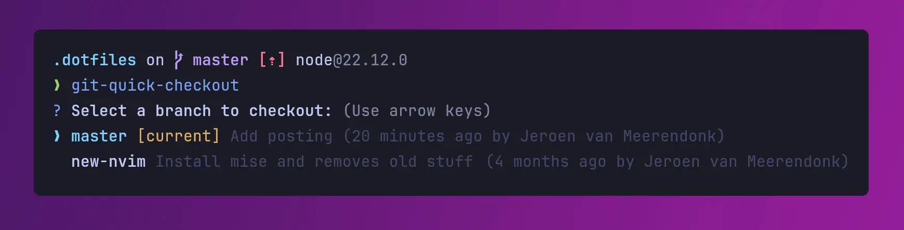

# git-quick-checkout

A CLI tool to list and switch recent Git branches, sorted by the latest commit.


## Features

- Select branches from a list using a keyboard interface.
- Sort branches by their most recent commit.
- View the last commit message, author, and relative timestamp for each branch.
- Checks for uncommitted changes before switching branches.





## Installation

```bash
npm install -g git-quick-checkout
```


## Usage

Use it in a directory with git with `git quick-checkout`.

My recommendation is to set an alias for it that works for you, like `git qco`. In your `.gitconfig` file:

```
[alias]
  co = checkout # Common alias, but not necessary
  qco = quick-checkout # Add this one!
```

This way you just need to run `git qco` 🚀


## Contributing

Contributions are welcome! Feel free to open issues or submit pull requests.
